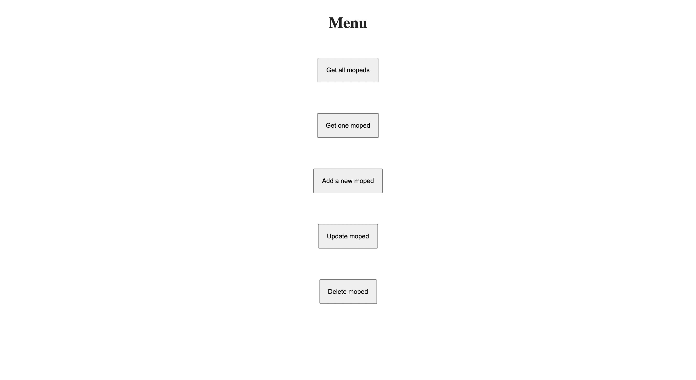

# Moped App

## Description

- A final assignment for Node / Express course in the Full Stack Web Development program in Business College Helsinki.

- With this app you are able to: 
    - retrieve list of all stored mopeds 
    - retrieve spesific moped with the moped id
    - add new mopeds to the existing list 
    - update the mopeds data 
    - delete spesific moped

## Technologies and tools used

- Node.js
- Express.js
- EJS

## Screenshots

